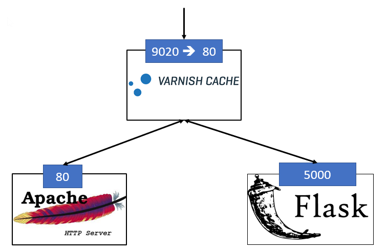
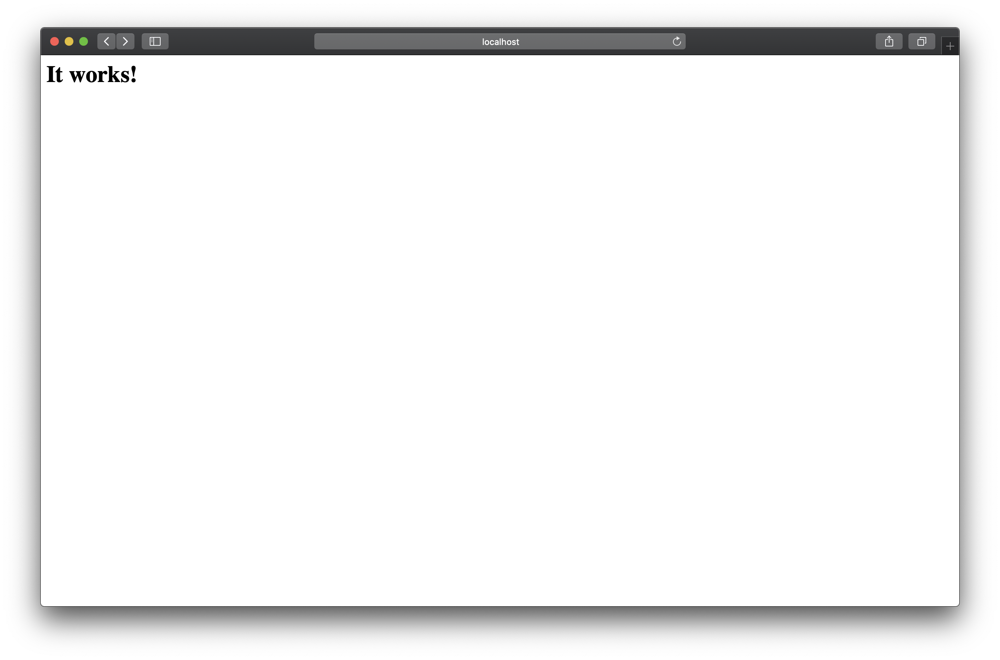

#   Websocket - HTTP Smuggling
##	Composition of (insecure) Applications




##	Usage

Only for POC/CTF. Do not use this in Production!

###	build

```bash
docker-compose up
```

The varnish server will on the port 9020.


### Mission statement

Visit http://localhost:9020/, you will see this:



This means everything is fine

By visiting http://localhost:9020/websocket.html, you will see a websocket example.


Your goal is to get the flag on the internal network flask.net. The url is /flag. Obviously you can't access the /flag from the outer network.

### Some help
Read carefully this site https://portswigger.net/web-security/request-smuggling and finish the tutorial to undertand the vulnerability 
